# neoESPA 문제 등록

> 2026년 3월 18일 문제를 업로드 하는 과정을 담았습니다.

## 등록할 문제 전달 받음

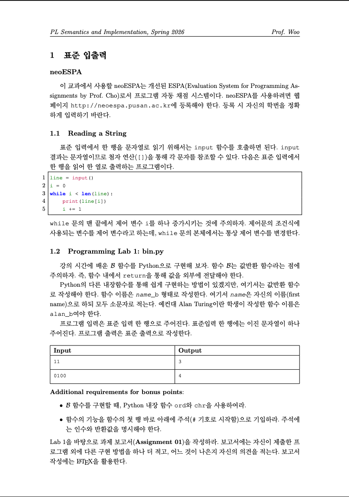

문제를 전달 받은 후 어떻게 풀지 확인합니다.

## 수업 환경 세팅

### (첫주차) 수업 폴더 생성

빈 폴더(2026_sem)를 만들고 기존 편의를 위해 구현한 쉘 스크립트(helper.sh)를 이용하여 문제를 위한 폴더를 만듭니다.

이후 이전에 만들었던 쉘 스크립트를 복사합니다.

폴더트리는 다음과 같습니다.

```
2026_sem/
└── helper.sh
```

쉘 스크립트는 아래와 같습니다.

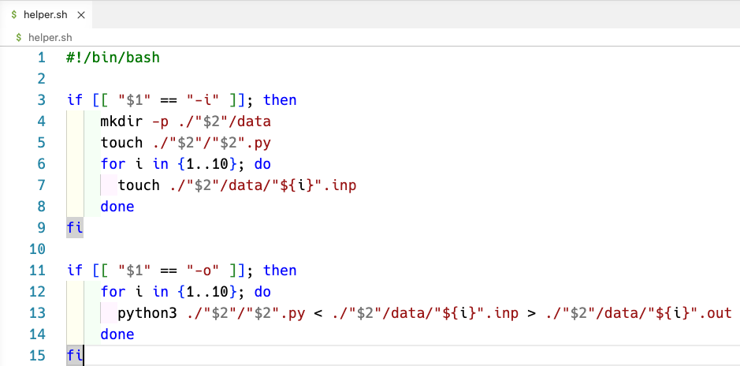

### 문제 폴더 생성

풀이 코드와 입출력을 위한 폴더를 생성합니다.

폴더를 생성하는 명령어는 아래와 같습니다.

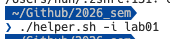

명령어를 입력하면 아래의 구조로 만들어 집니다. (01_Bin.pdf는 제가 넣은 것 입니다.)

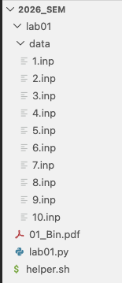

## 풀이 코드 작성

폴더 생성 시 같이 만든 lab01.py에 정답 코드를 작성합니다.

이번 문제의 풀이 코드는 아래와 같습니다.

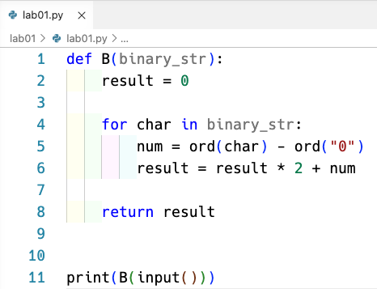

## 입력 생성

교수님의 요구사항이 있거나 문제에 맞는 입출력을 생성합니다.

입출력은 조교의 재량에 따라 난이도가 달라집니다.

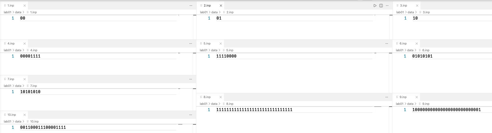

## 출력 생성

쉘 스크립트를 이용하여 코드와 입력에 맞춰 출력 파일을 생성합니다.

커맨드는 아래와 같습니다.


커맨드 실행 이후 폴더트리는 아래와 같습니다.

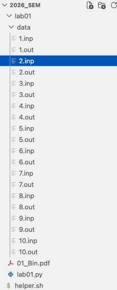

## 입출력 확인

정상적으로 입력에 따라 출력이 나왔는지 확인합니다.

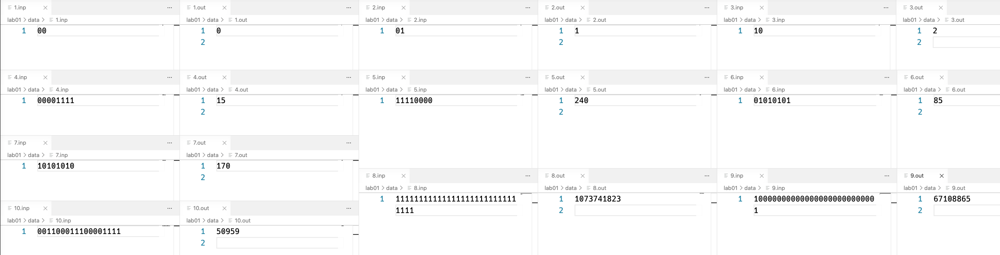

이상이 있을 경우 코드나 입력을 다시 수정합니다.

## 입출력 업로드를 위한 압축

입출력을 업로드 할 때는 zip파일로 업로드 합니다.

주의할 점은 폴더를 압축하는 것이 아닌, 파일들만을 압축해야합니다.

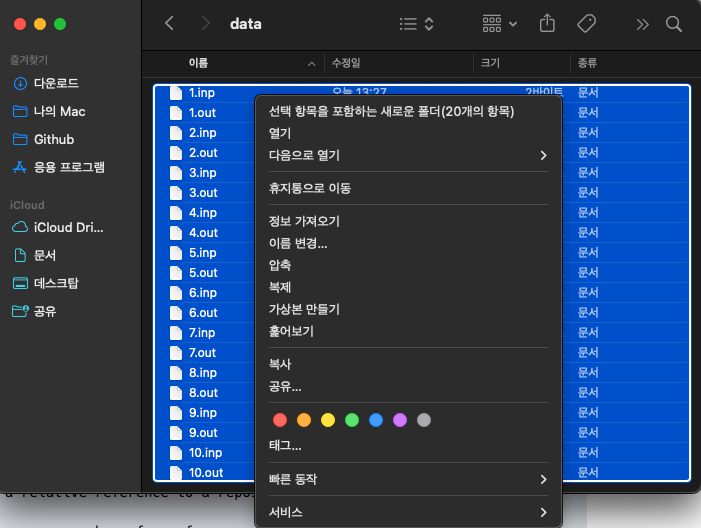

이후 생성된 zip파일의 이름을 편의상 data라고 명명합니다. (이름이 변경되어도 상관은 없습니다.)

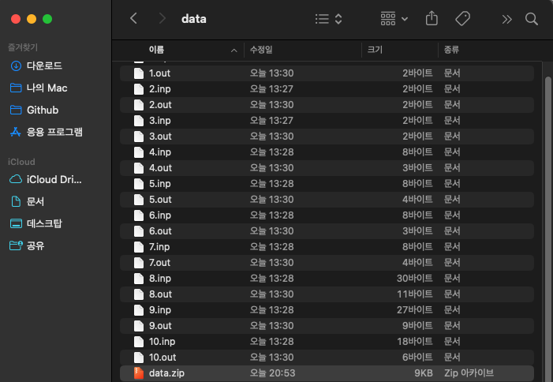

## 문제 등록

neoESPA에 관리자 화면으로 들어와 Assignment registration을 눌러 팝업을 띄워 줍니다.

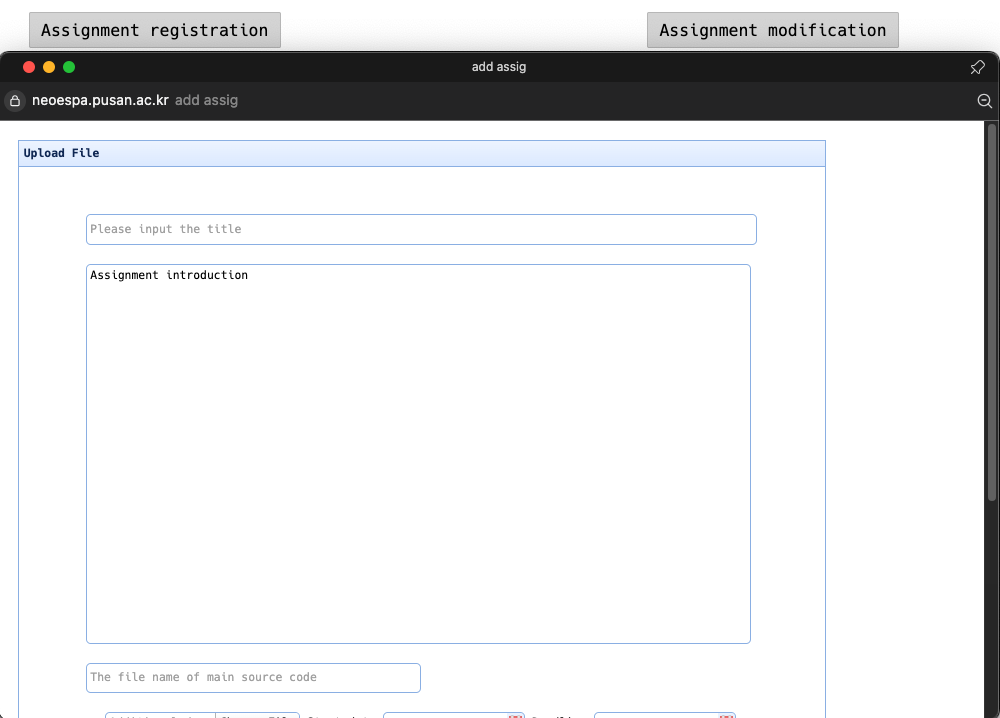

문제에 필요한 내용을 채워 줍니다.

주로 채우는 내용은 위에서 아래, 왼쪽에서 오른쪽 순서로 다음과 같습니다.

- Title
- 문제 파일
- Start data
- Deadline
- 입출력이 있는 압축 파일

> Lint 채점을 하게 된다면 is Lint를 Yes로 합니다.

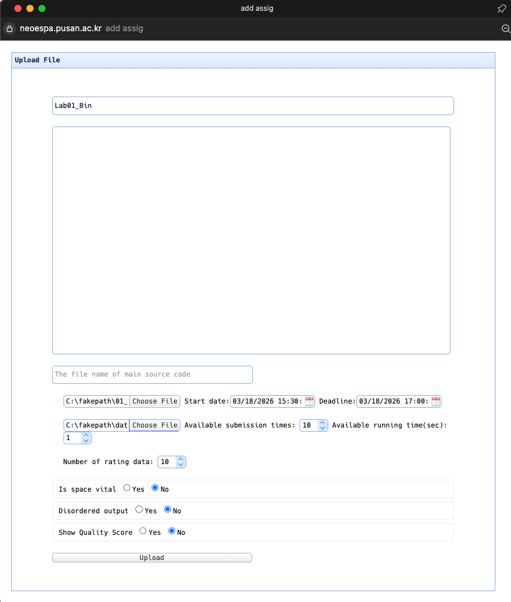

## 채점 확인

채점이 잘 동작하는지 확인합니다. 수업 초반에는 설정이 잘 안되어있을 수 있습니다.

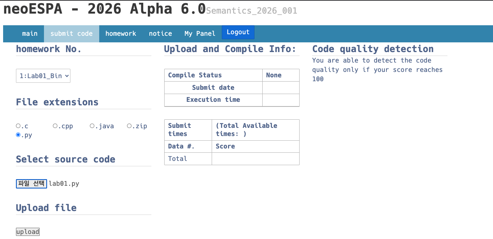

의도하지는 않았지만, submit을 한 후 에러가 있었습니다.

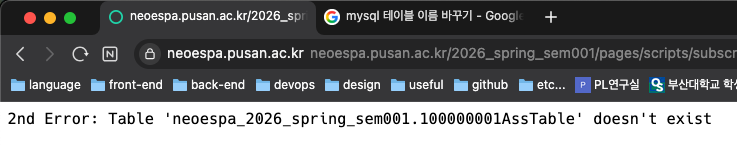

에러를 해결 한 후 채점이 잘 되었는지 확인합니다.

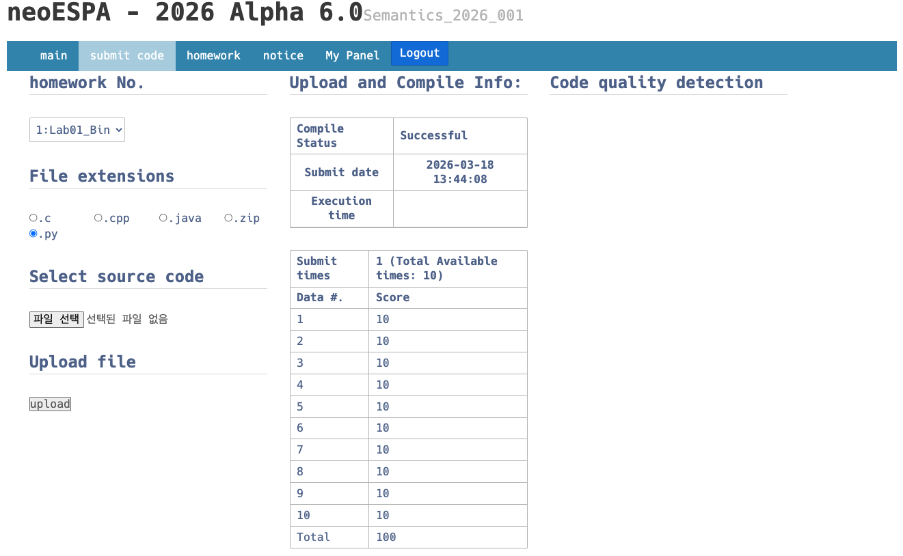

### 입출력 일치 확인

현재 neoESPA는 입출력이 정상적으로 업로드 되어있지 않은 경우 즉 입출력이 없는 경우에는 제출만 하면 100점을 주게 되어있습니다. 그러므로 입출력이 제대로 등록되었는지 확인합니다.
확인하는 방법은 아래와 같습니다.

1.  관리자 패널 접속

2.  Assignment submission status 클릭

    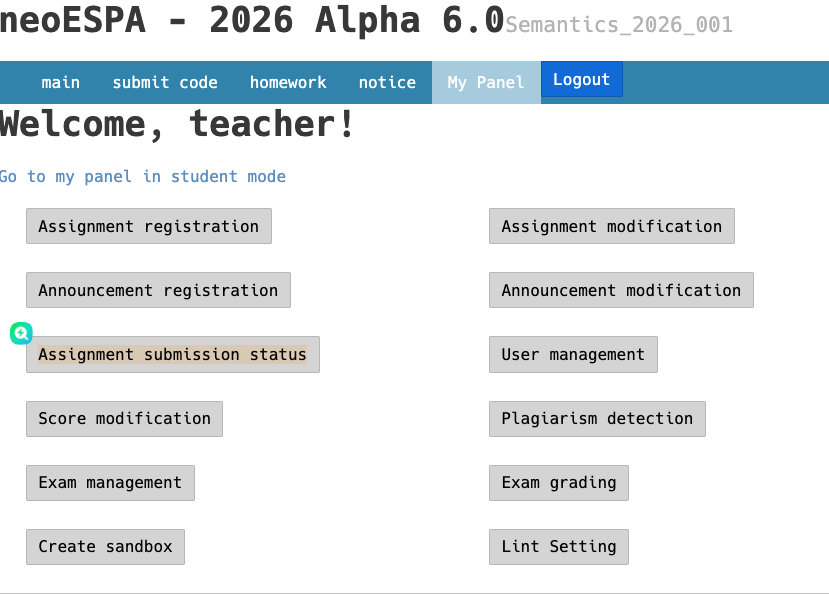

3.  Status 클릭 (스크린샷을 찍은 시점에는 종료되었습니다.)

    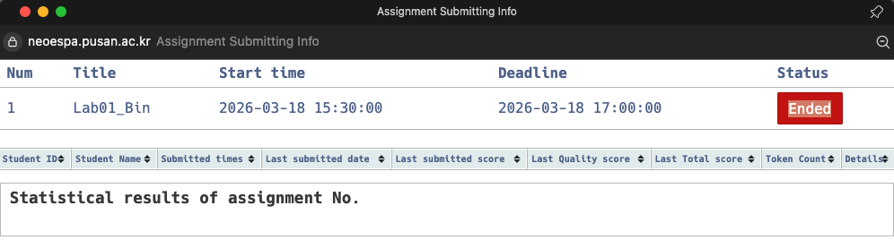

4.  submission details 클릭

    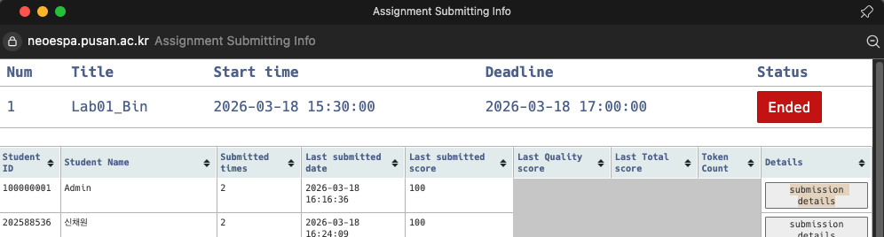

5.  Scores에서 점수를 클릭

    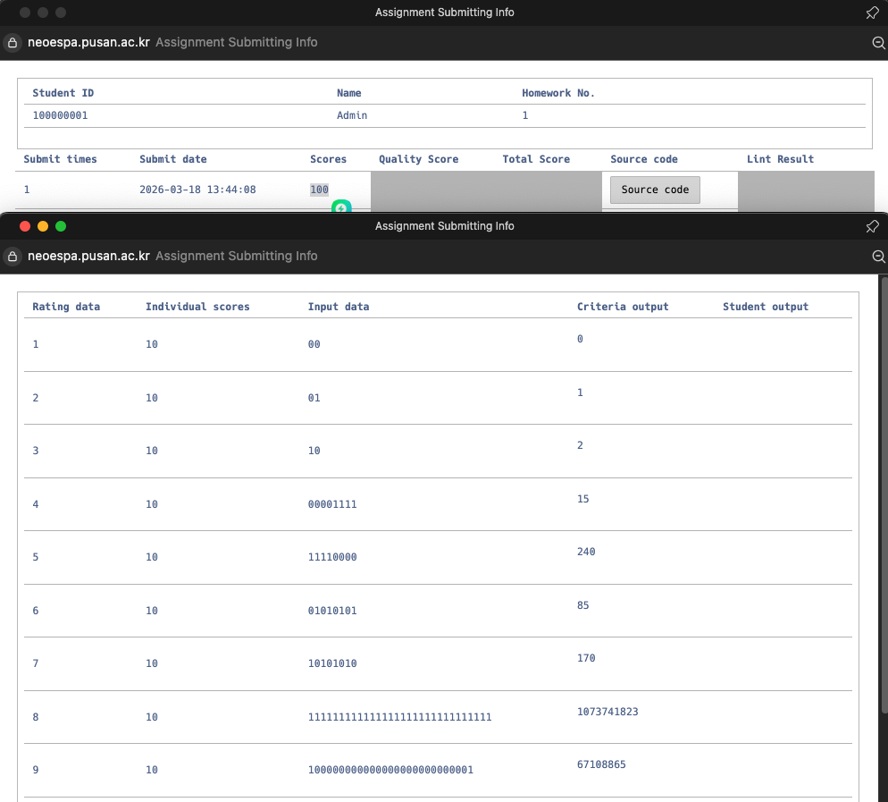

6.  입출력 확인

## 최종 폴더 트리

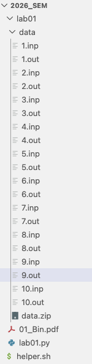
